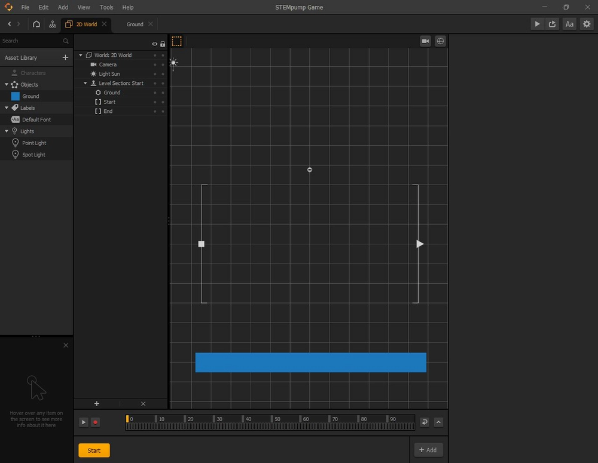
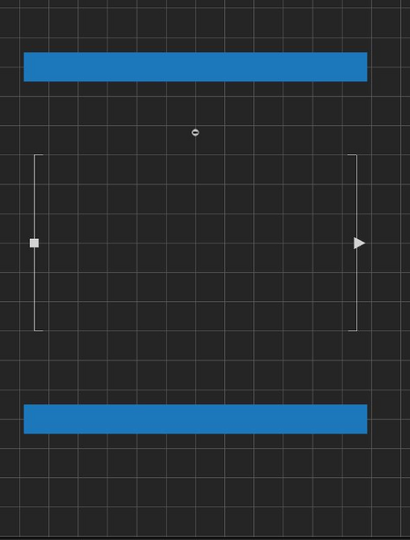

# 向场景添加资源

阅读耗时:alarm_clock:：2 分钟

## 如何向场景添加资源？

要将“Ground（地面）”资源添加到场景中，只需将资源从屏幕左侧拖动到网格即可。

## 如何调整资源的大小？

我们最终将我们的“Ground（地面）”资源放入场景中，但它看起来不像地面或地板。我们需要使资源足够长，以使它从起点到终点的覆盖整个底部。

若要扩展资源，请使用围绕它的较小的黑色方形，使其超出起点和终点支架。

## 我们如何移动资源？

移动资源相当简单。你所要做的就是将资源拖动到资源边界内的任何位置。要创建地板，请将资源拖到支架下方。

你的地板应该是这样的：

注意：你的地板不必与所示的颜色相同。

## 我们如何复制资源？

Buildbox 有一种非常方便的复制资源的方法。你可以根据要复制资源的位置使用 `W`、`A`、`S`、`D` 键，而不是使用标准的 `Ctrl`/`Command` + `C` 和 `Ctrl`/`Command` + `V` 键。

例如，我们还想为玩家设置一个上限，这样玩家就不会在玩得太高时迷路。
要在地板上方复制我们的资源，你可以按键盘上的 `W`，然后将其拖离支架的距离保持与地板与支架的距离相等。

总之，你的地板和天花板应该是这样的：

注意：对于精确的位置，你可以单击天花板或地板，并输入自己的 `X` 和 `Y` 位置数字。天花板的 `X` 位置为零，`Y` 位置为 12，而地板的 `X` 位置则为零，`Y` 位置为 `-12`。只要天花板和地板的宽度超过支架，刻度就不需要是精确的数字。

现在我们有了整体环境，让我们直接开始制作玩家。

》 [原文链接](https://stempump.org/course/buildbox/using-buildbox/l-adding-assets-to-the-scene)
