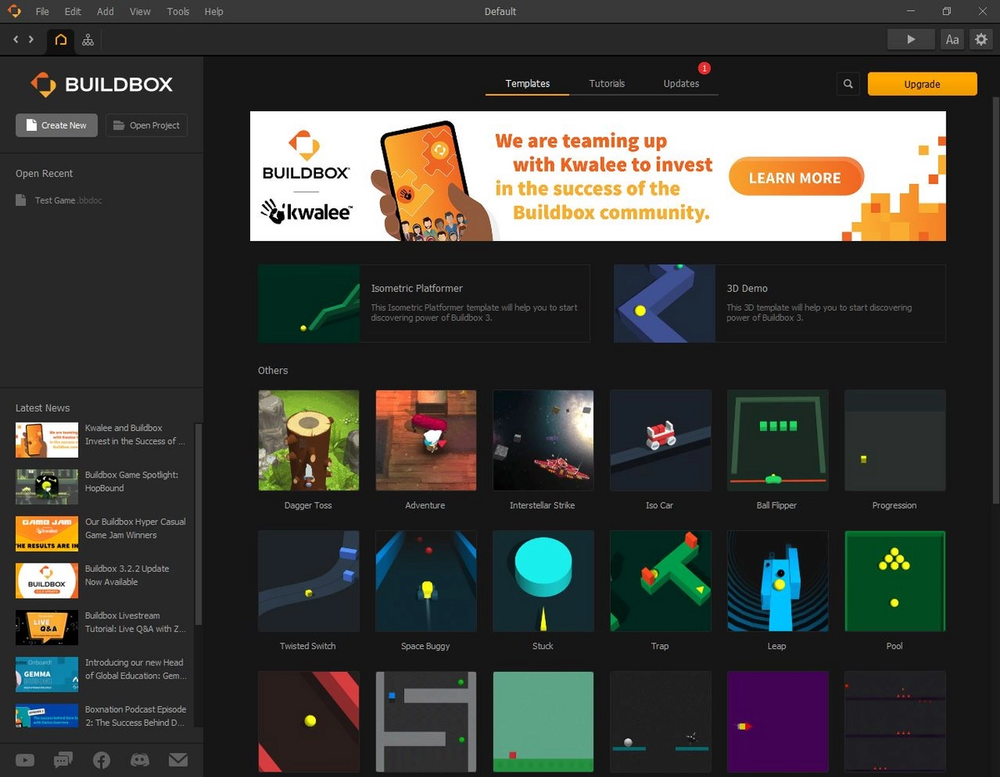
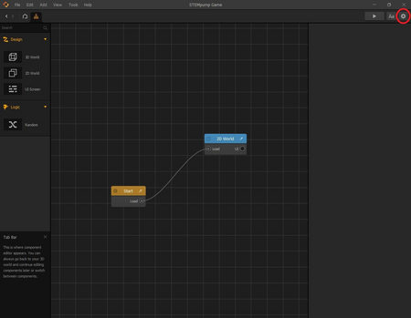

# 开始

阅读耗时:alarm_clock:：2 分钟

## 我们如何创建一个游戏

首先，你的屏幕应该是这样的。

现在，点击“Create New（新建）”按钮。

我们无尽的奔跑者将是一个二维（2D）游戏，所以现在我们将点击“Create 2D Game（创建 2D 游戏）”。

创建 2D 游戏后，屏幕应如下所示：

现在，我们将为游戏命名并设置其方向（纵向与横向）。如果你不熟悉“纵向”和“横向”这两个术语，纵向意味着游戏将在垂直的移动设备上进行，而横向意味着游戏应在移动设备侧放的情况下进行。

要给我们的游戏命名和方向，请单击屏幕右上角的齿轮图标。

你可以随意给游戏命名。如果你没有一个名字，只需输入“STEMpump Game”来识别这个项目。找到右侧的“Orientation（方向）”部分，如果尚未选择“Landscape（横向）”，则将方向从“Portrait（纵向）”更改为“Landscape（横向）”。然后，完成后单击“OK（确定）”。

我们的游戏基础已经建立！现在，在下一课中，让我们更深入地了解并确定我们的实际水平。

> [原文链接](https://stempump.org/course/buildbox/setting-up-buildbox/l-getting-started)
