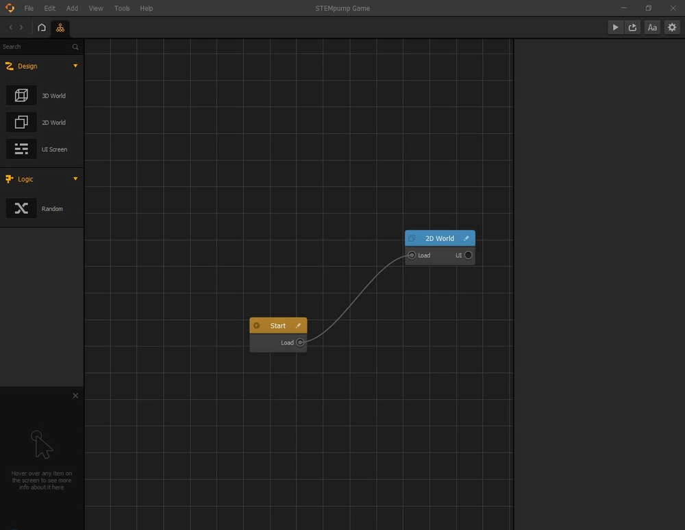
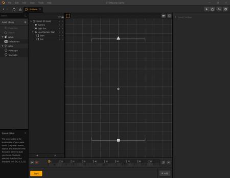
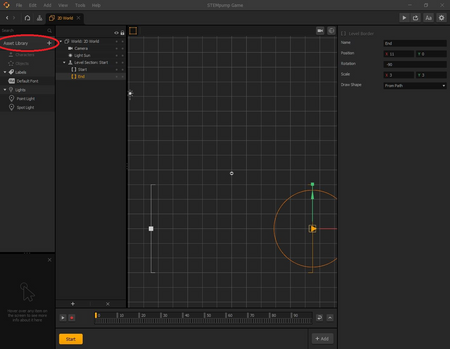
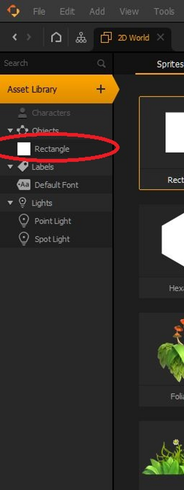
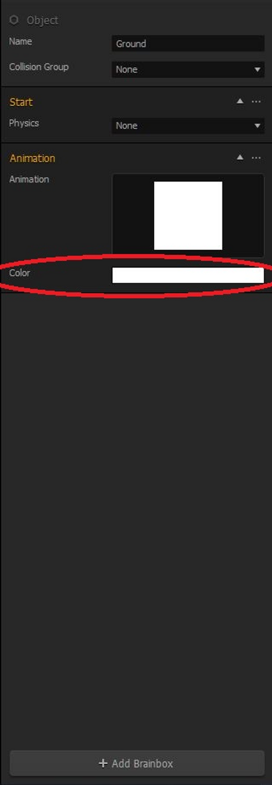
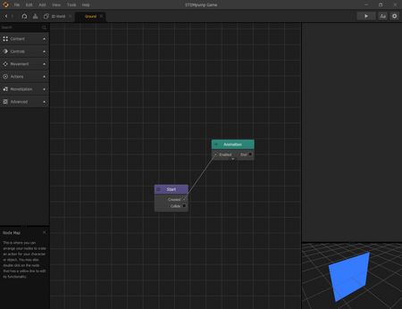
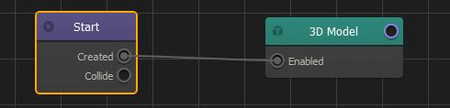
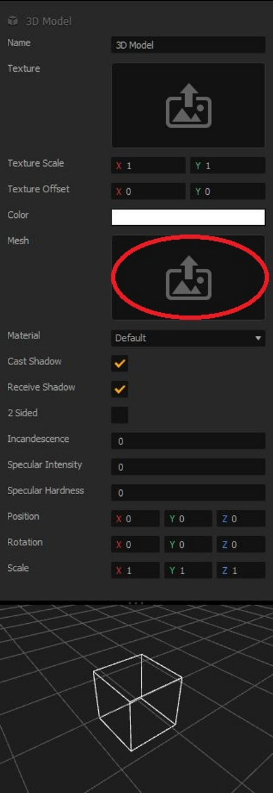

# 层级创建器

阅读耗时:alarm_clock:：5 分钟

> 设置我们层级的基础，以允许资源添加。

## 形成屏幕形状

这就是所谓的“思维导图”。在 Buildbox 中，思维导图用于演示用户玩游戏时的游戏流程。这就是你如何组织一个有多个关卡的游戏，显示加载屏幕，主菜单等。基本上，思维导图可以被认为是一种“胶水”，将你制作的所有不同场景组合在一起，形成整个游戏。

我们将双击“2D World”块，你的屏幕应如下所示：

由于我们的游戏将从左到右进行，我们需要改变场景的起点和终点，这些点目前正在从上到下移动。为此，单击正方形（起点），然后在右侧将 X 的位置更改为 -11，将 Y 的位置改为零。你也可以通过拖动绿色箭头来更改Y位置，拖动红色箭头来更改X位置来手动执行此操作。我们还希望将旋转设置为 -90 度。这也可以通过将正方形周围的圆拖动到所需的角度来手动完成。

现在，我们想对三角形（终点）做同样的事情。这里，我们希望 X 位置为 11，Y 位置为零。旋转也应为 -90 度。

## 为环境添加资产

现在我们的关卡形状已经制作好了，我们可以添加一些资源，使我们的关口充满活力，所以它不仅仅是一个空的空间。为此，单击此处显示的“Asset Library（资产库）”。

正如你所看到的，Buildbox 有各种各样的资产，2D 或 3D，你可以在游戏中使用。现在，我们将使用一个简单的矩形（列出的第一个资产）。要使用此资源，请双击“Rectangle（矩形）”。你会注意到，“Rectangle（矩形）”现在已添加到你的库中的 Objects（对象）下，如下所示：

接下来，再次单击“Asset Library（资产库）”按钮，将其关闭并返回级别编辑器。

我们想重命名我们的“Rectangle（矩形）”资产，这样它可以更容易识别。为此，单击 Objects（对象）选项卡下的“Rectangle（矩形）”选项卡一次，然后转到右侧并将其重命名为“Ground（地面）”。

要更改“Ground（地面）”资源的颜色，只需单击“Animation（动画）”选项卡正下方的“Color（颜色）”栏。你可以选择您想要的任何颜色。

某些版本的 Buildbox 要求所有资源都具有 3D 模型，即使它们是 2D 的。为了实现这一点，双击左侧的“Ground（地面）”面板，你将看到如下屏幕：

我们将选择绿色的“Animation（动画）”节点，然后按键盘上的“Delete（删除）”键，你猜到了，从“Ground（地面）”资源中删除该节点。这将消除资产的纯白色图像。尽管我们之前更改了资产的颜色，但不管怎样，游戏都会显示出一片白色。

在左侧，单击“Content（内容）”选项卡，然后将“Content（内容）”标签下的“3D 模型”节点拖动到网格中。

## 输入和输出

你可能注意到，我们的节点在其左侧或右侧都有这些圆。例如，“Start（开始）”节点的右侧有一个圆，名为“Collide（碰撞）”。这些圆圈是将一个节点链接到另一个节点的方式，这与在思维导图中将层级和不同屏幕链接在一起的方式完全相同。

节点右侧的圆圈是该特定节点的输出，而节点左侧的圆圈称为节点的输入。

要将“Start（开始）”节点连接到“3D 模型”节点，我们将从“Start（开始）”节点的“Created（已创建）”输出拖动一个链接至“3D 模型“节点的“Enabled（启用）”输入。反过来，结果应该是这样的：

## 向对象添加平面

既然我们的“Ground（地面）”资源与我们的“3D 模型”节点相链接，我们需要向资源添加一个平面，以便它对我们和玩家都是可见的。

为此，单击“3D 模型”节点将其选中（如果尚未选中），然后将光标悬停在右侧“Mesh（网格）”部分的向上箭头的图片上。

一旦鼠标移到该图标上，你会注意到右上角有一个铅笔图标。单击它，将显示“Mesh Manager（网格管理器）”。从网格管理器中，单击“Plane（平面）”，然后单击“Save（保存）”。
现在，平面的颜色是白色，如右下角所示。要改变这一点，请单击“Color（颜色）”旁边的区域，并为其赋予“Ground（地面）”资源的颜色。如果平面的颜色与地面颜色不完全匹配，请不要担心。它们不会以任何方式相互影响。

在返回场景之前，我们需要做的最后一件事是将 X 的旋转更改为90。这使玩家可以看到平面。

在下一课中，我们将向场景中添加地面，并为用户创建一个环境。

> [原文链接](https://stempump.org/course/buildbox/using-buildbox/l-level-creator)
