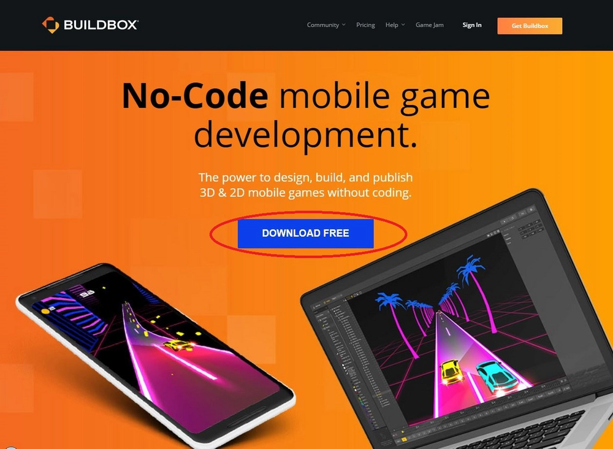
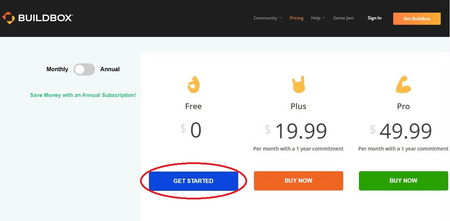

# 欢迎来到 BuildBox

阅读耗时:alarm_clock:：2 分钟

::: tip 浏览链接
以下课程使用此链接。
[BuildBox 官网](https://www.buildbox.com/)
:::

## 什么是 BuildBox？

Buildbox 是一个在线应用程序，允许你制作任何你想要的游戏，并允许你将该游戏导出为可在 App Store 或 Google Play Store 上下载的应用程序。Buildbox 最好的地方是，你不需要任何编程知识就可以正确使用应用程序。Buildbox 有一个非常容易使用的界面，本课程将引导你完成制作第一款游戏所需的步骤！

## 如何安装 BuildBox？

首先，转到上面列出的官方 Buildbox 站点，然后单击蓝色的“DOWNLOAD FREE（免费下载）”按钮。

然后，选择“Free（免费）”部分下的蓝色“Get Started（开始）”按钮。对于本课程的所有意图和目的，免费版本将提供我们所需的一切。

然后，继续为 Buildbox 创建一个帐户，并填写网站要求你填写的所有字段。当你到了“How did you find out about Buildbox?（你是怎么发现 Buildbox 的？）”选项时，如果你刚刚通过本课程和/或 STEMpump 网站或应用程序了解到，只需选择“其他”。

最后，单击“Get Buildbox Free（免费获取 Buildbox）”。

一旦你单击“Get Buildbox Free（免费获取 Buildbox）”，应用程序应该开始自行下载和安装。下载 Buildbox 时，请确保将屏幕上显示的许可证密钥保存在安全的地方。首次打开应用程序时，需要此密钥才能访问 Buildbox。

按照安装向导的说明完成 Buildbox 的安装。

Buildbox 完成安装后，打开它，然后输入你的许可证密钥，接着“万岁！” Buildbox 现在已启动并运行，准备就绪！

## 这门课我们要讲什么？

在本课程中，你将使用 Buildbox 制作你的第一个游戏，你可以告诉你的所有朋友和家人！更具体地说，我们将制作一个简单的无止境的跑步者，其中包括要避免的障碍和要收集的分数，这些都会加在你的分数上。

现在，既然你明白了我们将如何利用 Buildbox 的力量，让我们开始我们的第一场游戏吧！

> [原文链接](https://stempump.org/course/buildbox/setting-up-buildbox/l-welcome-to-buildbox)
